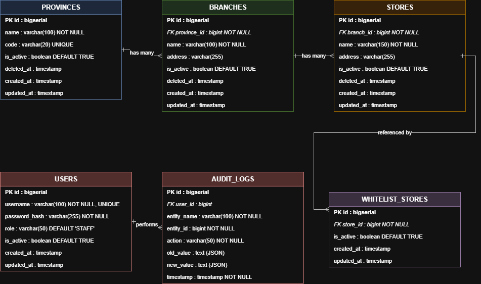

# Klik Indomaret Store & Branch Management System - Database Design Documentation
**Version:** 1.0  
**Platform:** PostgreSQL 18 / Spring Data JPA / Hibernate  
**Kandidat:** Stefanus  
**ID Pelamar:** OTH00060173  

---

## 1. Pendahuluan

### 1.1 Tujuan
Dokumen ini menyajikan rancangan arsitektur dan spesifikasi teknis basis data relasional untuk sistem **Klik Indomaret Store & Branch Management**. Basis data ini dioptimasi secara khusus untuk menampung data operasional gerai retail berjumlah besar (~20.000 toko), menjamin integritas relasional berjenjang (Provinsi $\rightarrow$ Cabang $\rightarrow$ Toko), memfasilitasi isolasi tabel toko Whitelist, mendukung penghapusan logis (*soft delete*), serta merekam histori perubahan data melalui *audit logging* dalam format JSON.

### 1.2 Definisi & Istilah
| Istilah | Deskripsi |
| :--- | :--- |
| **RDBMS** | Relational Database Management System (PostgreSQL 14+). |
| **PK (Primary Key)** | Kunci primer unik untuk setiap baris data, bertipe `BIGSERIAL` (64-bit integer auto-increment). |
| **FK (Foreign Key)** | Kunci asing penunjuk integritas relasi antar tabel dengan constraint referensial. |
| **Index B-Tree** | Struktur data indeks pada kolom foreign key dan kolom pencarian untuk mempercepat waktu eksekusi kueri ($O(\log N)$). |
| **Soft Delete** | Pola penghapusan dengan menandai flag `is_active = false` dan tanggal `deleted_at = NOW()` tanpa menghapus baris data secara permanen. |
| **Audit Trail** | Jejak rekam perubahan data historis yang mencatat aktor (`user_id`), nama entitas, aksi, nilai sebelum mutasi (`old_value`), dan nilai sesudah mutasi (`new_value`). |
| **N+1 Query Problem** | Kondisi latensi tinggi ketika pengambilan entitas induk memicu satu kueri terpisah per baris anak; dicegah dengan `JOIN FETCH`. |

---

## 2. Entity Relationship Diagram (ERD)

Berikut adalah diagram Entity Relationship Diagram (ERD) sistem basis data:



### 2.1 Ringkasan Entitas dan Kardinalitas Relasi
1. **`provinces` ke `branches` (1-to-Many / *has many*)**:  
   Satu provinsi dapat memiliki banyak kantor cabang wilayah operasional (`province_id` pada `branches` mereferensikan `id` pada `provinces`).
2. **`branches` ke `stores` (1-to-Many / *has many*)**:  
   Satu kantor cabang menaungi banyak gerai toko retail (`branch_id` pada `stores` mereferensikan `id` pada `branches`).
3. **`stores` ke `whitelist_stores` (1-to-One / *referenced by*)**:  
   Satu gerai toko dapat didaftarkan paling banyak satu kali ke tabel promosi prioritas whitelist (`store_id` pada `whitelist_stores` mereferensikan `id` pada `stores` secara unik).
4. **`users` ke `audit_logs` (1-to-Many / *performs*)**:  
   Satu pengguna sistem dapat melakukan banyak mutasi data cabang yang tercatat secara kronologis di tabel `audit_logs` (`user_id` pada `audit_logs` mereferensikan `id` pada `users`).

---

## 3. Data Dictionary / Spesifikasi Tabel

### 3.1 Tabel `provinces`
Menyimpan data master provinsi wilayah administratif.

| No | Field | Type | Mandatory | Default | Description |
| :---: | :--- | :--- | :---: | :--- | :--- |
| 1 | `id` | BIGSERIAL | YES | Auto-increment | Primary Key |
| 2 | `name` | VARCHAR(100) | YES | - | Nama provinsi (misal: "Jawa Barat") |
| 3 | `code` | VARCHAR(20) | NO | NULL | Kode singkatan unik provinsi (misal: "JB") |
| 4 | `is_active` | BOOLEAN | YES | TRUE | Status aktif provinsi |
| 5 | `deleted_at` | TIMESTAMP | NO | NULL | Waktu penghapusan soft delete |
| 6 | `created_at` | TIMESTAMP | YES | CURRENT_TIMESTAMP | Waktu pembuatan baris data |
| 7 | `updated_at` | TIMESTAMP | YES | CURRENT_TIMESTAMP | Waktu pembaruan terakhir data |

---

### 3.2 Tabel `branches`
Menyimpan kantor cabang operasional yang membawahi gerai-gerai toko.

| No | Field | Type | Mandatory | Default | Description |
| :---: | :--- | :--- | :---: | :--- | :--- |
| 1 | `id` | BIGSERIAL | YES | Auto-increment | Primary Key |
| 2 | `province_id` | BIGINT | YES | - | Foreign Key ke `provinces(id)` |
| 3 | `name` | VARCHAR(100) | YES | - | Nama cabang (misal: "Cabang Bandung") |
| 4 | `address` | VARCHAR(255) | NO | NULL | Alamat fisik kantor cabang |
| 5 | `is_active` | BOOLEAN | YES | TRUE | Flag aktif cabang (soft-delete target) |
| 6 | `deleted_at` | TIMESTAMP | NO | NULL | Waktu penonaktifan cabang |
| 7 | `created_at` | TIMESTAMP | YES | CURRENT_TIMESTAMP | Waktu pembuatan cabang |
| 8 | `updated_at` | TIMESTAMP | YES | CURRENT_TIMESTAMP | Waktu pembaruan data cabang |

---

### 3.3 Tabel `stores`
Menyimpan master data gerai toko retail Indomaret (~20.000 records).

| No | Field | Type | Mandatory | Default | Description |
| :---: | :--- | :--- | :---: | :--- | :--- |
| 1 | `id` | BIGSERIAL | YES | Auto-increment | Primary Key |
| 2 | `branch_id` | BIGINT | YES | - | Foreign Key ke `branches(id)` |
| 3 | `name` | VARCHAR(150) | YES | - | Nama gerai toko (misal: "Indomaret Dago") |
| 4 | `address` | VARCHAR(255) | NO | NULL | Alamat fisik gerai toko |
| 5 | `is_active` | BOOLEAN | YES | TRUE | Status aktif toko |
| 6 | `deleted_at` | TIMESTAMP | NO | NULL | Waktu soft delete |
| 7 | `created_at` | TIMESTAMP | YES | CURRENT_TIMESTAMP | Waktu pendaftaran toko |
| 8 | `updated_at` | TIMESTAMP | YES | CURRENT_TIMESTAMP | Waktu mutasi toko |

---

### 3.4 Tabel `whitelist_stores`
Menyimpan relasi gerai toko prioritas/whitelist promosi dengan kuota terbatasi.

| No | Field | Type | Mandatory | Default | Description |
| :---: | :--- | :--- | :---: | :--- | :--- |
| 1 | `id` | BIGSERIAL | YES | Auto-increment | Primary Key |
| 2 | `store_id` | BIGINT | YES | - | Foreign Key unik ke `stores(id)` |
| 3 | `is_active` | BOOLEAN | YES | TRUE | Status aktif keanggotaan whitelist |
| 4 | `created_at` | TIMESTAMP | YES | CURRENT_TIMESTAMP | Waktu penambahan ke whitelist |
| 5 | `updated_at` | TIMESTAMP | YES | CURRENT_TIMESTAMP | Waktu pembaruan |

---

### 3.5 Tabel `users`
Menyimpan akun pengguna terautentikasi untuk otorisasi akses API.

| No | Field | Type | Mandatory | Default | Description |
| :---: | :--- | :--- | :---: | :--- | :--- |
| 1 | `id` | BIGSERIAL | YES | Auto-increment | Primary Key |
| 2 | `username` | VARCHAR(100) | YES | - | Username unik (misal: "admin") |
| 3 | `password_hash` | VARCHAR(255) | YES | - | Hash sandi tersandi BCrypt ($2a$) |
| 4 | `role` | VARCHAR(50) | YES | 'STAFF' | Peran otorisasi ('ADMIN', 'STAFF') |
| 5 | `is_active` | BOOLEAN | YES | TRUE | Status keaktifan akun pengguna |
| 6 | `created_at` | TIMESTAMP | YES | CURRENT_TIMESTAMP | Waktu registrasi akun |
| 7 | `updated_at` | TIMESTAMP | YES | CURRENT_TIMESTAMP | Waktu pembaruan akun |

---

### 3.6 Tabel `audit_logs`
Menyimpan catatan riwayat seluruh mutasi data (`CREATE`, `UPDATE`, `DELETE`) pada entitas bisnis.

| No | Field | Type | Mandatory | Default | Description |
| :---: | :--- | :--- | :---: | :--- | :--- |
| 1 | `id` | BIGSERIAL | YES | Auto-increment | Primary Key log |
| 2 | `user_id` | BIGINT | NO | NULL | Foreign Key ke `users(id)` aktor |
| 3 | `entity_name` | VARCHAR(100) | YES | - | Nama entitas yang berubah (misal: "Branch") |
| 4 | `entity_id` | BIGINT | YES | - | ID entitas yang dimutasi |
| 5 | `action` | VARCHAR(50) | YES | - | Tipe mutasi: 'CREATE', 'UPDATE', 'DELETE' |
| 6 | `old_value` | TEXT | NO | NULL | Snapshot JSON data sebelum perubahan |
| 7 | `new_value` | TEXT | NO | NULL | Snapshot JSON data sesudah perubahan |
| 8 | `timestamp` | TIMESTAMP | YES | CURRENT_TIMESTAMP | Waktu eksekusi mutasi |

---

## 4. Strategi Indexing & Optimasi Query

Untuk menjamin performa tinggi pada volume data toko retail (~20.000 gerai), diterapkan skema indeks strategis:

### 4.1 Daftar Indeks Database
| No | Nama Indeks | Tabel | Kolom | Tipe Indeks | Tujuan Optimasi |
| :---: | :--- | :--- | :--- | :---: | :--- |
| 1 | `idx_provinces_name` | `provinces` | `name` | B-Tree | Mempercepat filter pencarian nama provinsi |
| 2 | `idx_provinces_is_active` | `provinces` | `is_active` | B-Tree | Filter baris provinsi yang berstatus aktif |
| 3 | `idx_branches_province_id` | `branches` | `province_id` | B-Tree | Mempercepat query join cabang ke provinsi |
| 4 | `idx_branches_is_active` | `branches` | `is_active` | B-Tree | Memfilter cabang aktif pada pencarian toko |
| 5 | `idx_stores_branch_id` | `stores` | `branch_id` | B-Tree | Menghilangkan full table scan saat join relasi |
| 6 | `idx_stores_is_active` | `stores` | `is_active` | B-Tree | Filter cepat hanya untuk toko yang aktif |
| 7 | `idx_whitelist_store_id` | `whitelist_stores` | `store_id` | B-Tree (Unique) | Mempercepat join dan mencegah duplikasi whitelist |
| 8 | `idx_audit_logs_user_id` | `audit_logs` | `user_id` | B-Tree | Mempercepat kueri pelacakan audit per pengguna |
| 9 | `idx_audit_logs_timestamp`| `audit_logs` | `timestamp` | B-Tree | Optimasi pengurutan kronologis log |

### 4.2 Mitigasi N+1 Query Problem
Pada implementasi Spring Data JPA, pemanggilan entitas toko beserta relasi cabangnya dioptimasi dengan klausa kustom `JOIN FETCH`:
```sql
SELECT DISTINCT s FROM Store s 
JOIN FETCH s.branch b 
JOIN FETCH b.province p 
WHERE s.isActive = true 
  AND b.isActive = true 
  AND LOWER(p.name) LIKE LOWER(CONCAT('%', :provinceName, '%'))
```
Dengan strategi ini, Hibernate hanya mengeksekusi **1 kueri SQL tunggal** dengan `INNER JOIN` bertingkat, bukan mengeksekusi 1 kueri utama ditambah ribuan sub-kueri untuk setiap cabang.

---

## 5. Mekanisme Soft Delete & Audit Trail

### 5.1 Alur Logika Soft Delete
Operasi `DELETE /api/branches/{id}` tidak menjalankan perintah `DELETE FROM branches`, melainkan:
1. Membaca record cabang yang sedang aktif.
2. Menyimpan snapshot representasi JSON entitas ke variabel `old_value`.
3. Memperbarui kolom `is_active = false` dan `deleted_at = CURRENT_TIMESTAMP`.
4. Menyimpan record event ke tabel `audit_logs` dengan aksi `DELETE`.
5. Toko-toko di bawah cabang non-aktif secara otomatis terfilter keluar dari hasil kueri pencarian reguler.

### 5.2 Skema Payload JSON Audit Log
Data perubahan pada kolom `old_value` dan `new_value` diformat dalam struktur JSON standar:
```json
{
  "id": 1,
  "name": "Cabang Bandung Utama",
  "address": "Jl. Soekarno Hatta No. 200, Bandung",
  "provinceId": 1,
  "provinceName": "Jawa Barat",
  "isActive": true
}
```

---

## 6. Skrip DDL Database (PostgreSQL)

```sql
-- 1. Tabel Master Provinsi
CREATE TABLE provinces (
    id BIGSERIAL PRIMARY KEY,
    name VARCHAR(100) NOT NULL,
    code VARCHAR(20) UNIQUE,
    is_active BOOLEAN NOT NULL DEFAULT TRUE,
    deleted_at TIMESTAMP,
    created_at TIMESTAMP NOT NULL DEFAULT CURRENT_TIMESTAMP,
    updated_at TIMESTAMP NOT NULL DEFAULT CURRENT_TIMESTAMP
);

-- 2. Tabel Master Cabang
CREATE TABLE branches (
    id BIGSERIAL PRIMARY KEY,
    province_id BIGINT NOT NULL REFERENCES provinces(id),
    name VARCHAR(100) NOT NULL,
    address VARCHAR(255),
    is_active BOOLEAN NOT NULL DEFAULT TRUE,
    deleted_at TIMESTAMP,
    created_at TIMESTAMP NOT NULL DEFAULT CURRENT_TIMESTAMP,
    updated_at TIMESTAMP NOT NULL DEFAULT CURRENT_TIMESTAMP
);

-- 3. Tabel Master Toko
CREATE TABLE stores (
    id BIGSERIAL PRIMARY KEY,
    branch_id BIGINT NOT NULL REFERENCES branches(id),
    name VARCHAR(150) NOT NULL,
    address VARCHAR(255),
    is_active BOOLEAN NOT NULL DEFAULT TRUE,
    deleted_at TIMESTAMP,
    created_at TIMESTAMP NOT NULL DEFAULT CURRENT_TIMESTAMP,
    updated_at TIMESTAMP NOT NULL DEFAULT CURRENT_TIMESTAMP
);

-- 4. Tabel Whitelist Toko
CREATE TABLE whitelist_stores (
    id BIGSERIAL PRIMARY KEY,
    store_id BIGINT NOT NULL UNIQUE REFERENCES stores(id),
    is_active BOOLEAN NOT NULL DEFAULT TRUE,
    created_at TIMESTAMP NOT NULL DEFAULT CURRENT_TIMESTAMP,
    updated_at TIMESTAMP NOT NULL DEFAULT CURRENT_TIMESTAMP
);

-- 5. Tabel Pengguna (Otentikasi & Otorisasi)
CREATE TABLE users (
    id BIGSERIAL PRIMARY KEY,
    username VARCHAR(100) NOT NULL UNIQUE,
    password_hash VARCHAR(255) NOT NULL,
    role VARCHAR(50) NOT NULL DEFAULT 'STAFF',
    is_active BOOLEAN NOT NULL DEFAULT TRUE,
    created_at TIMESTAMP NOT NULL DEFAULT CURRENT_TIMESTAMP,
    updated_at TIMESTAMP NOT NULL DEFAULT CURRENT_TIMESTAMP
);

-- 6. Tabel Audit Log
CREATE TABLE audit_logs (
    id BIGSERIAL PRIMARY KEY,
    user_id BIGINT REFERENCES users(id),
    entity_name VARCHAR(100) NOT NULL,
    entity_id BIGINT NOT NULL,
    action VARCHAR(50) NOT NULL,
    old_value TEXT,
    new_value TEXT,
    timestamp TIMESTAMP NOT NULL DEFAULT CURRENT_TIMESTAMP
);

-- Indeks Performa
CREATE INDEX idx_provinces_name ON provinces(name);
CREATE INDEX idx_provinces_is_active ON provinces(is_active);
CREATE INDEX idx_branches_province_id ON branches(province_id);
CREATE INDEX idx_branches_is_active ON branches(is_active);
CREATE INDEX idx_stores_branch_id ON stores(branch_id);
CREATE INDEX idx_stores_is_active ON stores(is_active);
CREATE INDEX idx_whitelist_store_id ON whitelist_stores(store_id);
CREATE INDEX idx_audit_logs_user_id ON audit_logs(user_id);
CREATE INDEX idx_audit_logs_timestamp ON audit_logs(timestamp);
```
