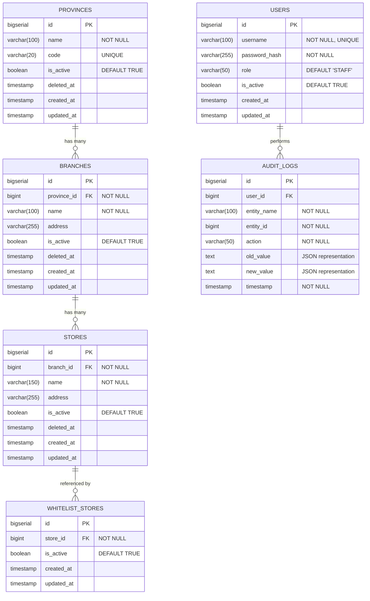

# DATABASE DESIGN DOCUMENTATION
## Backend Developer Technical Assignment — Klik Indomaret

**Kandidat**: Stefanus  
**ID Pelamar**: OTH00060173  
**Database**: PostgreSQL 14+  
**ORM**: Spring Data JPA / Hibernate  

---

## 1. Ringkasan Desain Arsitektur Data

Desain skema database ini dirancang untuk mendukung operasional ritel berskala besar (~20.000 data toko) dengan prioritas pada:
1. **Integritas Relasional Bertingkat**: Mengikuti hierarki riil operasional ritel: `Province` $\rightarrow$ `Branch` $\rightarrow$ `Store`.
2. **Optimasi Performa Query**: Mencegah bottleneck pembacaan data besar melalui indexing pada foreign keys dan kolom filter pencarian.
3. **Pemisahan Entitas Dinamis**: Mengisolasi entitas `whitelist_stores` ke tabel tersendiri untuk mencegah mutasi atau locking berlebih pada tabel master `stores`.
4. **Data Auditing & Compliance**: Merekam jejak perubahan data master secara historis (state lama vs state baru) dalam format JSON.
5. **Soft Delete**: Memastikan histori data transaksi tidak terputus saat cabang atau toko dinonaktifkan.

---

## 2. Entity Relationship Diagram (ERD)



---

## 3. Spesifikasi Skema Tabel

### 3.1 Tabel `provinces`
Menyimpan data master provinsi wilayah administratif.

| Kolom | Tipe Data | Constraint | Keterangan |
|---|---|---|---|
| `id` | `BIGSERIAL` | PRIMARY KEY | Identifikasi unik provinsi |
| `name` | `VARCHAR(100)` | NOT NULL | Nama provinsi (misal: Jawa Barat) |
| `code` | `VARCHAR(20)` | UNIQUE | Kode unik provinsi (misal: JB) |
| `is_active` | `BOOLEAN` | NOT NULL, DEFAULT TRUE | Indikator status aktif |
| `deleted_at` | `TIMESTAMP` | NULLABLE | Waktu soft delete |
| `created_at` | `TIMESTAMP` | NOT NULL, DEFAULT CURRENT_TIMESTAMP | Waktu pencatatan |
| `updated_at` | `TIMESTAMP` | NOT NULL, DEFAULT CURRENT_TIMESTAMP | Waktu pembaruan |

### 3.2 Tabel `branches`
Menyimpan kantor cabang operasional wilayah Indomaret di bawah suatu provinsi.

| Kolom | Tipe Data | Constraint | Keterangan |
|---|---|---|---|
| `id` | `BIGSERIAL` | PRIMARY KEY | Identifikasi unik cabang |
| `province_id` | `BIGINT` | NOT NULL, FK `provinces(id)` | Referensi ke provinsi |
| `name` | `VARCHAR(100)` | NOT NULL | Nama cabang (misal: Cabang Bandung) |
| `address` | `VARCHAR(255)` | NULLABLE | Alamat kantor cabang |
| `is_active` | `BOOLEAN` | NOT NULL, DEFAULT TRUE | Indikator status aktif |
| `deleted_at` | `TIMESTAMP` | NULLABLE | Waktu soft delete |
| `created_at` | `TIMESTAMP` | NOT NULL, DEFAULT CURRENT_TIMESTAMP | Waktu pencatatan |
| `updated_at` | `TIMESTAMP` | NOT NULL, DEFAULT CURRENT_TIMESTAMP | Waktu pembaruan |

### 3.3 Tabel `stores`
Menyimpan data fisik gerai/toko Indomaret yang bernaung di bawah suatu cabang operasional.

| Kolom | Tipe Data | Constraint | Keterangan |
|---|---|---|---|
| `id` | `BIGSERIAL` | PRIMARY KEY | Identifikasi unik toko |
| `branch_id` | `BIGINT` | NOT NULL, FK `branches(id)` | Referensi ke cabang operasional |
| `name` | `VARCHAR(150)` | NOT NULL | Nama toko (misal: Indomaret Dago) |
| `address` | `VARCHAR(255)` | NULLABLE | Alamat fisik toko |
| `is_active` | `BOOLEAN` | NOT NULL, DEFAULT TRUE | Indikator status aktif |
| `deleted_at` | `TIMESTAMP` | NULLABLE | Waktu soft delete |
| `created_at` | `TIMESTAMP` | NOT NULL, DEFAULT CURRENT_TIMESTAMP | Waktu pencatatan |
| `updated_at` | `TIMESTAMP` | NOT NULL, DEFAULT CURRENT_TIMESTAMP | Waktu pembaruan |

### 3.4 Tabel `whitelist_stores`
Menyimpan daftar toko yang mendapatkan status whitelist prioritas.

| Kolom | Tipe Data | Constraint | Keterangan |
|---|---|---|---|
| `id` | `BIGSERIAL` | PRIMARY KEY | Identifikasi unik entri whitelist |
| `store_id` | `BIGINT` | NOT NULL, FK `stores(id)` | Referensi ke toko yang di-whitelist |
| `is_active` | `BOOLEAN` | NOT NULL, DEFAULT TRUE | Status keaktifan whitelist |
| `created_at` | `TIMESTAMP` | NOT NULL, DEFAULT CURRENT_TIMESTAMP | Waktu toko masuk whitelist |
| `updated_at` | `TIMESTAMP` | NOT NULL, DEFAULT CURRENT_TIMESTAMP | Waktu pembaruan status |

### 3.5 Tabel `users`
Menyimpan kredensial pengguna dan wewenang otorisasi sistem.

| Kolom | Tipe Data | Constraint | Keterangan |
|---|---|---|---|
| `id` | `BIGSERIAL` | PRIMARY KEY | Identifikasi unik pengguna |
| `username` | `VARCHAR(100)` | NOT NULL, UNIQUE | Username login |
| `password_hash` | `VARCHAR(255)` | NOT NULL | Password terenkripsi BCrypt |
| `role` | `VARCHAR(50)` | NOT NULL, DEFAULT 'STAFF' | Peran pengguna (ADMIN / STAFF) |
| `is_active` | `BOOLEAN` | NOT NULL, DEFAULT TRUE | Status akun |
| `created_at` | `TIMESTAMP` | NOT NULL, DEFAULT CURRENT_TIMESTAMP | Waktu registrasi |
| `updated_at` | `TIMESTAMP` | NOT NULL, DEFAULT CURRENT_TIMESTAMP | Waktu perubahan akun |

### 3.6 Tabel `audit_logs`
Menyimpan riwayat perubahan data master untuk audit compliance.

| Kolom | Tipe Data | Constraint | Keterangan |
|---|---|---|---|
| `id` | `BIGSERIAL` | PRIMARY KEY | Identifikasi unik log |
| `user_id` | `BIGINT` | NULLABLE, FK `users(id)` | Operator pelaku perubahan |
| `entity_name` | `VARCHAR(100)` | NOT NULL | Nama entitas (misal: 'Branch') |
| `entity_id` | `BIGINT` | NOT NULL | ID entitas yang dimodifikasi |
| `action` | `VARCHAR(50)` | NOT NULL | Jenis aksi (`CREATE`, `UPDATE`, `DELETE`) |
| `old_value` | `TEXT` | NULLABLE | Snapshot JSON data sebelum perubahan |
| `new_value` | `TEXT` | NULLABLE | Snapshot JSON data sesudah perubahan |
| `timestamp` | `TIMESTAMP` | NOT NULL, DEFAULT CURRENT_TIMESTAMP | Waktu eksekusi aksi |

---

## 4. Strategi Indexing untuk Skala Data Besar

Mengingat volume data retail mencapai puluhan ribu entri, index ditambahkan secara spesifik:

```sql
-- 1. Index pencarian nama provinsi (mendukung operasi ILIKE / case-insensitive search)
CREATE INDEX idx_provinces_name ON provinces(name);

-- 2. Index foreign keys untuk relasi JOIN bertingkat
CREATE INDEX idx_branches_province_id ON branches(province_id);
CREATE INDEX idx_stores_branch_id ON stores(branch_id);

-- 3. Index pencarian toko whitelist
CREATE INDEX idx_whitelist_stores_store_id ON whitelist_stores(store_id);

-- 4. Index pencarian audit log berdasarkan entitas dan ID
CREATE INDEX idx_audit_logs_entity ON audit_logs(entity_name, entity_id);
```

### Manfaat Indexing:
- **Index FK (`idx_stores_branch_id` & `idx_branches_province_id`)**: Mengurangi kompleksitas join dari Full Table Scan ($O(N)$) menjadi Index Scan ($O(\log N)$).
- **Index Audit (`idx_audit_logs_entity`)**: Mempercepat penarikan riwayat perubahan entitas tertentu secara instan tanpa memindai seluruh tabel log.

---

## 5. Keputusan Desain Penting (Design Decisions & Trade-offs)

### 5.1 Rationale Pemisahan Tabel `whitelist_stores`
**Alternatif Desain A**: Menambahkan kolom `is_whitelist BOOLEAN` pada tabel `stores`.  
**Keputusan yang Dipilih**: Tabel terpisah `whitelist_stores`.  
**Alasan Teknis**:
1. **Isolasi Mutasi**: Perubahan status whitelist sering terjadi untuk kebutuhan promosi. Pemisahan tabel mencegah lock baris pada tabel master `stores` yang sering dibaca.
2. **Efisiensi Query Whitelist**: Query penarikan toko whitelist hanya memindai tabel kecil ($\le 50$ baris) alih-alih memfilter kolom flag pada $20.000$ baris tabel `stores`.
3. **Fleksibilitas Atribut Masa Depan**: Tabel terpisah memudahkan penambahan atribut khusus whitelist di kemudian hari (misal: `expired_at`, `priority_weight`, `notes`) tanpa mengubah skema tabel `stores`.

### 5.2 Strategi Soft Delete
Entitas master (`provinces`, `branches`, `stores`) menerapkan pola **Soft Delete**:
- Tidak mengeksekusi perintah SQL `DELETE FROM table`.
- Mengubah `is_active = false` dan mengisi `deleted_at = CURRENT_TIMESTAMP`.
- Seluruh query operasional JPA menerapkan klausul filter otomatis:
  ```sql
  WHERE is_active = true AND deleted_at IS NULL
  ```
- **Tujuan**: Menjaga integritas data historis audit, laporan penjualan masa lalu, dan menghindari error *foreign key constraint violation*.

### 5.3 Strategi Audit Logging
Pencatatan dilakukan secara terstruktur pada tingkat Service Layer:
- Saat terjadi mutasi (`CREATE`, `UPDATE`, `DELETE`), service mengambil snapshot objek DTO.
- Snapshot diubah menjadi representasi string JSON oleh Jackson `ObjectMapper`.
- Disimpan secara transaksional ke tabel `audit_logs` bersamaan dengan ID user yang terotentikasi dari konteks Spring Security.
